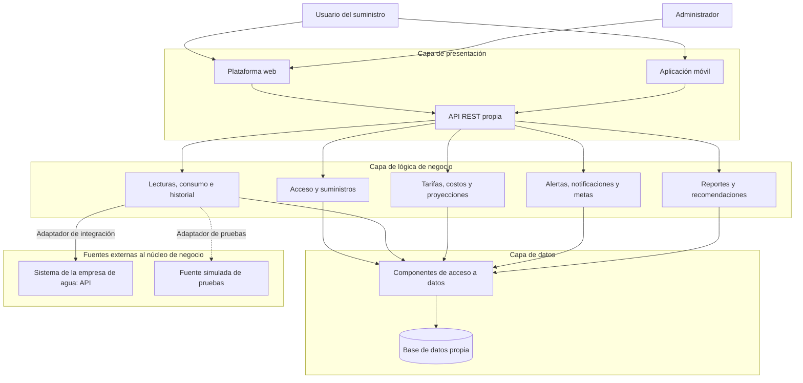
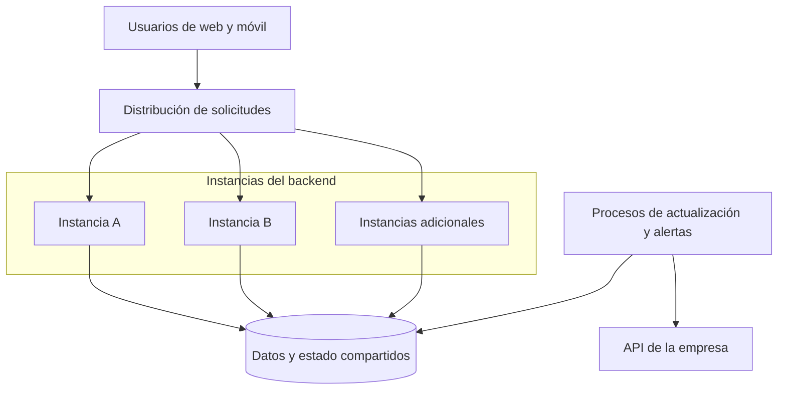

# Arquitectura inicial del sistema

## 1. Propósito

La arquitectura organiza el sistema web y móvil para consultar
el consumo de agua, estimar costos, presentar proyecciones
y generar alertas.

La propuesta considera:
- Integración con la API de la empresa prestadora.
- Acceso a suministros autorizados.
- Conservación y procesamiento de lecturas.
- Resultados consistentes entre web y móvil.
- Atención de al menos 5000 usuarios activos simultáneamente.
- Posibilidad de ampliar la capacidad según la demanda.

La capacidad deberá demostrarse mediante pruebas sobre
una implementación y una infraestructura definidas.

## 2. Organización en tres capas

| Capa | Elementos | Responsabilidad |
|---|---|---|
| Presentación | Aplicación web, aplicación móvil y API REST propia | Mostrar información, recibir acciones y dirigir las solicitudes hacia las operaciones del backend. |
| Lógica de negocio | Módulos de acceso, suministros, lecturas, consumo, costos, alertas, metas y reportes | Aplicar permisos, validar información, realizar cálculos y coordinar las operaciones. |
| Datos | Componentes de acceso a datos y base de datos propia | Guardar y consultar usuarios, autorizaciones, suministros, lecturas, tarifas, resultados, notificaciones y registros de operación. |

La API REST se ejecutará en el backend. Se ubica en presentación
porque constituye la interfaz de entrada a las funciones del sistema.

La separación en capas es lógica. Su ejecución puede distribuirse
entre varias instancias y procesos.

## 3. Módulos de negocio

Para facilitar la lectura del diagrama, las responsabilidades
se agrupan en cinco conjuntos.

| Conjunto | Responsabilidades |
|---|---|
| Acceso y suministros | Autenticación, sesiones, roles, permisos, usuarios y vinculación de suministros. |
| Lecturas, consumo e historial | Integración con la fuente, validación, control de duplicados, cálculo de consumo, cobertura de datos, historial y comparaciones. |
| Tarifas, costos y proyecciones | Configuración tarifaria, vigencias, estimaciones económicas y proyecciones. |
| Alertas, notificaciones y metas | Evaluación de consumo elevado y anomalías, registro de avisos, estado de lectura y seguimiento de metas personales. |
| Reportes y recomendaciones | Preparación de reportes y selección de recomendaciones mediante reglas definidas. |

La administración y supervisión utilizan las funciones protegidas
de estos módulos. Las recomendaciones no requieren incorporar
un modelo de inteligencia artificial.

## 4. Diagrama lógico de arquitectura

Las flechas representan el uso principal de componentes
o la dirección de las solicitudes. Las respuestas se omiten
para facilitar la lectura.

La fuente simulada sustituye a la real en el entorno de pruebas.
No representa un actor adicional del funcionamiento productivo.

Los medidores envían información al sistema de la empresa.
Nuestra plataforma no se comunica directamente con ellos
ni accede directamente a su base de datos.

## 5. Relaciones entre módulos

- Acceso y suministros comprueba los permisos requeridos
  por las operaciones de los demás módulos.
- Lecturas proporciona información validada para calcular
  consumos, costos, proyecciones y alertas.
- Costos utiliza el consumo y las versiones tarifarias
  correspondientes al periodo.
- Alertas evalúa las lecturas y los consumos disponibles,
  comprobando que existan datos suficientes.
- Las metas de presupuesto utilizan los costos estimados.
- Reportes utiliza las mismas reglas y resultados que las consultas.
- Las recomendaciones se seleccionan según el consumo,
  las comparaciones y las alertas aplicables.

Las interfaces web y móvil no implementarán por separado
las reglas de consumo, tarifas o proyecciones.

## 6. Integración y actualización de datos

El componente de integración encapsulará los detalles de comunicación
con la empresa: autenticación, solicitudes, respuestas y errores.

Un adaptador transformará los datos externos al formato interno.
La fuente simulada implementará la misma interfaz interna.

El mecanismo concreto de actualización dependerá del proveedor:

- Si permite consultar lecturas, se utilizará una sincronización
  programada que respete sus límites.
- Si envía eventos, se habilitará un punto de recepción que verifique
  su procedencia y valide su contenido.

Estas alternativas deben resolverse al conocer el contrato real.
No se presupone que la empresa ofrezca ambas.

### Secuencia de incorporación

1. Obtener o recibir las lecturas disponibles.
2. Identificar el suministro, medidor, fecha, unidad y tipo de dato.
3. Validar los registros y detectar duplicados.
4. Conservar los originales y registrar los errores encontrados.
5. Incorporar los datos válidos al historial.
6. Calcular o actualizar los resultados afectados.
7. Evaluar las condiciones de alerta y las metas.
8. Actualizar el estado de procesamiento del suministro.

Las correcciones de lecturas deberán provocar la revisión
de los resultados afectados, conservando su trazabilidad.

## 7. Distribución de ejecución para la concurrencia

Se propone un backend modular que pueda ejecutarse en varias
instancias, junto con procesos de trabajo para la actualización
y evaluación de información.

Los módulos pertenecen a la misma solución. La propuesta inicial
no exige desplegar cada módulo como un microservicio.

Este diagrama representa unidades de ejecución. El acceso a la base
de datos se realizará mediante los componentes de la capa de datos.

Las instancias A, B y adicionales son conceptuales: su cantidad
y sus recursos se determinarán mediante pruebas.

### Atención de solicitudes
- Las solicitudes se distribuirán entre instancias disponibles.
- Las sesiones y autorizaciones deberán funcionar de manera
  consistente aunque una solicitud llegue a otra instancia.
- La información necesaria para continuar una sesión no dependerá
  exclusivamente de la memoria local de un servidor.
- El acceso a la base de datos utilizará conexiones controladas,
  índices adecuados y consultas paginadas.

### Procesos de actualización y alertas
- La actualización no se ejecutará nuevamente por cada consulta
  de un usuario.
- Los procesos utilizarán las mismas reglas de validación y cálculo
  que el resto del backend.
- Las tareas pendientes y su estado se conservarán de forma
  persistente para permitir su recuperación.
- Se coordinará la ejecución para evitar que varios procesos
  incorporen o calculen de manera incompatible los mismos datos.
- Los reintentos respetarán el control de duplicados.

El mecanismo de coordinación de tareas se seleccionará durante
la implementación, sin exigir desde ahora un producto concreto.

### Reportes
La generación de reportes tendrá límites de tamaño y recursos
para proteger las consultas interactivas.

Si las pruebas justifican generación diferida, se incorporarán
los requisitos de consulta de estado y descarga posterior antes
de implementar ese comportamiento.

## 8. Consistencia y almacenamiento

La base de datos propia conservará:
- Usuarios, roles, sesiones y autorizaciones.
- Suministros y sus identificadores en la empresa.
- Lecturas originales, correcciones y resultados de validación.
- Periodos y cobertura de datos.
- Configuraciones tarifarias y vigencias.
- Resultados calculados y sus referencias de origen cuando se almacenen.
- Metas, alertas y notificaciones.
- Estados de tareas e incidencias de integración.

Los resultados almacenados identificarán las lecturas, tarifas
y parámetros utilizados.

Durante una actualización se deberá evitar mostrar combinaciones
inconsistentes, como un consumo nuevo con un costo anterior
sin indicar que el cálculo está pendiente.

Se definirá una estrategia de copias de seguridad y recuperación.
Tener varias instancias de aplicación no sustituye la protección
y disponibilidad de la base de datos.

## 9. Funcionamiento ante fallos

| Situación | Comportamiento esperado |
|---|---|
| La API externa no responde | Mantener consultas sobre información almacenada, mostrar su fecha y registrar la interrupción. |
| Llegan lecturas duplicadas | Reconocerlas y evitar que incrementen nuevamente el consumo. |
| Faltan lecturas | Identificar el periodo incompleto y evitar interpretarlo como consumo cero. |
| Se interrumpe un proceso de actualización | Recuperar las tareas pendientes sin duplicar resultados ni avisos. |
| Falla una instancia del backend | Dirigir nuevas solicitudes a instancias disponibles y recuperar las operaciones según corresponda. |
| La base de datos no está disponible | Informar que la operación no puede completarse y aplicar el procedimiento de recuperación; no mostrar datos inventados. |
| La carga supera la capacidad comprobada | Controlar la admisión de trabajo, informar los fallos y recuperar el servicio evitando pérdidas o corrupción de datos. |

## 10. Justificación de las decisiones

| Decisión | Drivers relacionados |
|---|---|
| Varias instancias y distribución de solicitudes | DA01, DA02 |
| Actualización separada de las consultas del usuario | DA01, DA04 |
| Validación, control de duplicados y trazabilidad | DA03, DA07 |
| Adaptadores para la API real y la fuente simulada | DA04, DA11 |
| Autorización por usuario y suministro en el backend | DA05 |
| Reglas comunes para web y móvil | DA06 |
| Tarifas versionadas y cálculos identificables | DA08 |
| Evaluación controlada de alertas y metas | DA09 |
| Control de recursos utilizados por reportes | DA10 |
| Separación en capas y módulos | DA12 |

## 11. Verificación de la capacidad

Se evaluará la arquitectura con los escenarios definidos
en 04-atributos-de-calidad.md.

La prueba deberá incluir:
- Al menos 5000 usuarios activos simultáneamente.
- Operaciones sobre distintos suministros.
- Actualización de lecturas y evaluación de alertas.
- Consultas de historial, metas, notificaciones y reportes.
- Comprobaciones de exactitud y permisos.
- Medición de tiempos, errores, solicitudes atendidas y recursos.

Se aumentará progresivamente la carga para identificar
la capacidad máxima comprobada y los componentes limitantes.

## 12. Decisiones pendientes

- Tecnologías del backend, web y aplicación móvil.
- Motor y configuración de la base de datos.
- Infraestructura y recursos por instancia.
- Mecanismo de autenticación para suministros reales.
- Contrato y condiciones de la API externa.
- Coordinación de tareas y recuperación de procesos.
- Métodos de proyección y reglas de anomalías.
- Política de conservación, copias de seguridad y recuperación.
- Necesidad de caché u otras optimizaciones según las mediciones.

El objetivo de 5000 usuarios orienta este diseño.
Su cumplimiento dependerá de la implementación y de los resultados
obtenidos sobre la infraestructura evaluada.