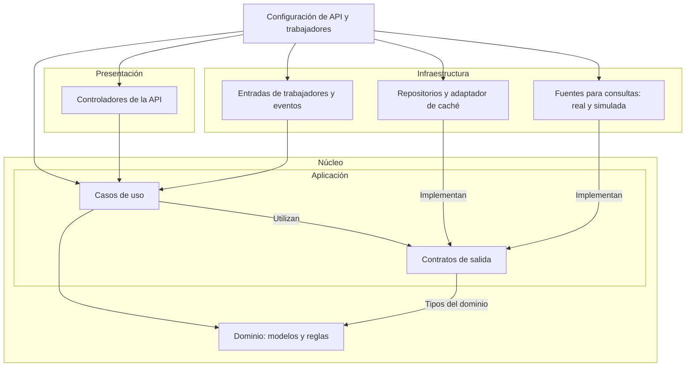

# Enfoque arquitectónico del sistema de consumo de agua

## 1. Propósito

Este documento describe cómo se organizarán las responsabilidades
y dependencias internas del backend del sistema de consumo de agua.

Desarrolla la decisión de aplicar Clean Architecture,
establecida en ADR-002.

El estilo arquitectónico describe la organización general
y la distribución de la ejecución. Este documento precisa
cómo colaborará el código dentro de esa organización.

## 2. Enfoque seleccionado

Se distinguirán cuatro partes:

- Dominio.
- Aplicación.
- Infraestructura.
- Presentación.

Dominio y Aplicación formarán el núcleo.

Los contratos de salida necesarios para los casos de uso
se definirán en Aplicación, utilizando tipos del dominio
cuando corresponda.

Infraestructura implementará esos contratos.

La configuración conectará los casos de uso
con las implementaciones seleccionadas.

Esta organización se aplicará dentro de los cinco módulos
funcionales establecidos en ADR-001.

## 3. Distribución de responsabilidades

| Parte | Responsabilidades | Ejemplos del proyecto |
|---|---|---|
| Dominio | Representar los conceptos y reglas fundamentales del negocio. | Lectura, Suministro, Periodo, Tarifa, Meta y Alerta; compatibilidad de mediciones, unidades y vigencia tarifaria. |
| Aplicación | Coordinar casos de uso, autorizaciones, colaboración entre módulos y contratos de salida. | Incorporar lecturas, consultar consumos, estimar costos, generar proyecciones, evaluar alertas y preparar reportes. |
| Infraestructura | Resolver persistencia, comunicación externa, caché y ejecución técnica de trabajos. | Repositorios concretos, adaptador real, fuente simulada, adaptador de caché y entradas de trabajadores. |
| Presentación | Recibir solicitudes y convertirlas en operaciones del sistema, presentando sus resultados. | Controladores de la API REST e interfaces web y móvil. |

Las interfaces web y móvil serán clientes de la API.

Su comunicación con el backend se realizará mediante HTTP.
No necesitarán importar las clases internas del núcleo
para utilizar sus operaciones.

Los nombres de entidades, casos de uso y contratos
son elementos propuestos del diseño.
Su implementación está pendiente.

## 4. Reglas del dominio

Las reglas se mantendrán en los componentes responsables
del núcleo y serán comunes para la API y los trabajadores.

### Lecturas y consumo

- Diferenciar lecturas acumuladas de consumos por intervalo.
- Calcular diferencias únicamente entre lecturas compatibles.
- Evitar sumar intervalos superpuestos.
- Normalizar litros y metros cúbicos.
- Identificar cambios o reinicios de medidor.
- Conservar la interpretación de periodos incompletos.
- Evitar interpretar datos ausentes como consumo cero.

### Tarifas y estimaciones

- Utilizar tarifas aplicables al suministro y periodo.
- Conservar las versiones utilizadas en resultados históricos.
- Informar cuando falte una tarifa necesaria.
- Distinguir consumos observados y valores proyectados.
- Presentar los costos como estimaciones.

### Alertas y metas

- Evaluar condiciones cuando existan datos suficientes.
- Mantener las metas relacionadas con su suministro y periodo.
- Identificar los eventos para controlar avisos repetidos.
- Presentar anomalías como situaciones que requieren revisión.

La detección duradera de duplicados, la coordinación de tareas
y el control de escrituras simultáneas requerirán
la colaboración de Aplicación y la persistencia.

## 5. Casos de uso

Aplicación coordinará las operaciones del sistema.

Se consideran, entre otros:

| Grupo | Casos de uso propuestos |
|---|---|
| Acceso y suministros | Comprobar autorización, seleccionar suministro y gestionar accesos y vinculaciones. |
| Lecturas, consumo e historial | Incorporar lecturas, consultar resumen e historial y solicitar reprocesamiento. |
| Tarifas, costos y proyecciones | Gestionar tarifas, estimar costos y calcular proyecciones. |
| Alertas, notificaciones y metas | Evaluar alertas, consultar avisos, marcar notificaciones y gestionar metas. |
| Reportes y recomendaciones | Generar reportes autorizados y seleccionar recomendaciones de ahorro. |

Estos ejemplos no reemplazan los 39 requisitos funcionales.

Cada operación protegida comprobará el contexto de ejecución,
el rol y la autorización sobre el suministro correspondiente.

Los trabajos técnicos utilizarán un contexto autorizado
para sus tareas. No dependerán de una sesión interactiva
de un usuario.

## 6. Contratos de salida

Los contratos expresarán las necesidades de los casos de uso,
sin incorporar detalles de una tecnología concreta.

| Contrato propuesto | Necesidad que representa |
|---|---|
| Repositorios de suministros y autorizaciones | Consultar suministros reconocidos y permisos aplicables. |
| Repositorio de lecturas | Consultar e incorporar registros, detectar repeticiones y conservar correcciones. |
| Repositorio de tarifas | Obtener configuraciones y versiones aplicables. |
| Repositorios de resultados y avisos | Conservar resultados, referencias de cálculo y estados de notificación. |
| Repositorio de tareas e incidencias | Registrar avance, fallos y recuperación del procesamiento. |
| Caché de consultas | Recuperar, almacenar e invalidar resultados reutilizables según ADR-003. |
| Fuente de lecturas para consultas | Obtener registros disponibles cuando el proveedor permita esa modalidad. |

Los contratos de persistencia deberán permitir
las comprobaciones y escrituras coordinadas que requieran
los casos de uso.

Las garantías de concurrencia y recuperación deberán
definirse y comprobarse durante el diseño técnico.

Si la empresa utiliza eventos, un adaptador de entrada
entregará los registros al caso de uso de incorporación,
conforme a ADR-004.

No se exigirá un contrato de consulta al proveedor
si esa operación no está disponible.

## 7. Diagrama de dependencias del código

Una flecha A hacia B significa que el código de A
conoce o utiliza elementos definidos en B.

Las flechas hacia los contratos también representan
la dependencia necesaria para implementarlos.

El diagrama describe dependencias del código.
El intercambio de datos durante la ejecución
se presenta en el documento del estilo arquitectónico.

La configuración pertenece al ensamblaje externo.
Puede conocer los casos de uso y las implementaciones
para conectarlos.

El bloque de fuentes representa adaptadores de salida
cuando se utilice la modalidad de consultas.

La entrada de eventos solamente se habilitará
si existe un mecanismo autorizado por la empresa.

La fuente real y la simulada son alternativas seleccionadas
por entorno; no se mezclarán en producción.

## 8. Reglas de dependencia

1. Dominio mantendrá sus modelos y reglas sin importar
   controladores, clientes del proveedor o implementaciones
   de almacenamiento.

2. Aplicación utilizará el dominio y sus propios contratos.

3. Los casos de uso no importarán repositorios concretos,
   clientes de caché o adaptadores específicos de la empresa.

4. Infraestructura implementará los contratos y transformará
   los formatos externos al modelo interno.

5. Los controladores y las entradas de trabajadores
   delegarán las operaciones a los casos de uso.

6. La configuración seleccionará e inyectará
   las implementaciones correspondientes.

7. Los módulos colaborarán mediante interfaces internas,
   respetando la responsabilidad sobre sus datos.

Estas reglas deberán reflejarse en las importaciones reales.
Crear carpetas con esos nombres no será suficiente.

## 9. Ejemplo de incorporación de lecturas

El ejemplo corresponde a la modalidad de consultas,
si el proveedor la autoriza.

1. Una entrada del trabajador inicia el caso de uso.
2. El caso de uso solicita registros mediante el contrato
   de la fuente.
3. El adaptador seleccionado obtiene o simula los registros.
4. El núcleo valida la información y aplica sus reglas.
5. El caso de uso coordina la persistencia, los duplicados
   y las correcciones.
6. Se revisan los cálculos afectados y las alertas.
7. Se registra el avance y se publican resultados coherentes.
8. Se aplica el control de versiones e invalidación de caché.

Durante la ejecución, el objeto que implementa el contrato
puede ser el adaptador real o la fuente simulada.

El caso de uso conservará su dependencia del contrato
definido en Aplicación.

Si se utilizan eventos, cambiará la forma de entrada,
manteniendo el procesamiento común del núcleo.

## 10. Datos que atraviesan las interfaces

Las solicitudes y respuestas utilizarán estructuras
definidas para las operaciones de Aplicación.

Los formatos del proveedor se transformarán
antes de utilizarse en los cálculos.

Los objetos específicos del motor de base de datos,
del cliente HTTP o de la herramienta de caché
no se trasladarán al núcleo.

Los resultados identificarán, cuando corresponda:

- Suministro y periodo.
- Unidades y cobertura.
- Fechas de medición, recepción y cálculo.
- Versiones de lecturas y tarifas.
- Método y parámetros.
- Estado de actualización y limitaciones.

Los controladores transformarán las respuestas
al formato de nuestra API.

## 11. Configuración y ejecución

La configuración preparará los casos de uso
con sus repositorios y adaptadores.

Los procesos de API y los trabajadores utilizarán
versiones compatibles de la misma base de código.

Se configurarán por entorno:

- Fuente de lecturas.
- Acceso a persistencia.
- Caché, cuando esté habilitada.
- Credenciales y permisos técnicos.
- Mecanismos de ejecución y supervisión.

Las credenciales productivas permanecerán fuera
del código y del historial de Git.

La separación de procesos seguirá ADR-001.
La separación de dependencias seguirá ADR-002.

## 12. Relación con los drivers

El enfoque responde principalmente a DA12:
permite localizar cambios en responsabilidades delimitadas.

También contribuye a:

- DA03: reglas de integridad comprobables y coordinación
  explícita con la persistencia.
- DA05: autorización dentro de los casos de uso protegidos.
- DA06: reglas comunes para web y móvil.
- DA08: estimaciones relacionadas con tarifas y versiones.
- DA11: sustitución de la fuente mediante contratos.

La integración y el uso de caché respetarán
ADR-004 y ADR-003, respectivamente.

## 13. Verificación prevista

Se revisarán las importaciones para comprobar
las reglas de dependencia.

Las pruebas del dominio incluirán unidades,
compatibilidad, intervalos, tarifas y datos insuficientes.

Los casos de uso se probarán con implementaciones
controladas de sus contratos.

Se comprobarán autorizaciones, duplicados, correcciones,
alertas y recuperación del procesamiento.

Las pruebas de integración verificarán que los adaptadores
cumplan los contratos del núcleo y del proveedor.

La consistencia entre web y móvil se evaluará
con los mismos datos, versiones y parámetros.

La capacidad de 5000 usuarios se comprobará por separado,
sobre la implementación y la infraestructura completas.

La aplicación de Clean Architecture no demuestra
por sí sola el cumplimiento de esa capacidad.

## 14. Documentos relacionados

- [Estilo arquitectónico](../estilo-arquitectonico.md).
- [ADR-001: Backend modular](../decisiones/ADR-001-monolito-modular.md).
- [ADR-002: Clean Architecture](../decisiones/ADR-002-clean-architecture.md).
- [ADR-003: Caché de consultas](../decisiones/ADR-003-cache-consultas.md).
- [ADR-004: Integración de lecturas](../decisiones/ADR-004-integracion-lecturas.md).

## 15. Estado y referencia técnica

Este documento establece el enfoque propuesto.

La implementación y las verificaciones del sistema de agua
están pendientes.

Referencia técnica:

- Robert C. Martin: [The Clean Architecture](https://blog.cleancoder.com/uncle-bob/2012/08/13/the-clean-architecture.html).