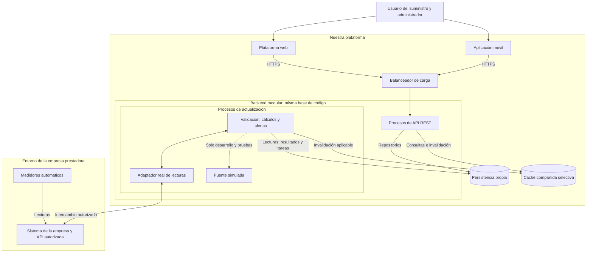

# Estilo arquitectónico del sistema de consumo de agua

## 1. Propósito

Este documento describe la organización general del sistema
web y móvil para consultar el consumo de agua y estimar sus costos.

La propuesta evoluciona desde la arquitectura inicial
de tres capas y utiliza las decisiones registradas en la Guía 03.

El diseño busca atender al menos 5000 usuarios activos
simultáneamente, manteniendo la actualización de lecturas,
los cálculos y la evaluación de alertas.

La capacidad deberá comprobarse sobre una implementación
y una infraestructura documentadas.

## 2. Organización seleccionada

La solución utilizará una relación cliente-servidor:
las interfaces web y móvil consumirán la API REST propia.

El backend se organizará como un monolito modular,
con cinco módulos que mantendrán responsabilidades
e interfaces internas definidas.

La misma base de código permitirá ejecutar procesos
dedicados a la API y procesos trabajadores dedicados
a las actualizaciones.

Ambos reutilizarán las reglas y los casos de uso del núcleo,
manteniendo una gestión conjunta de versiones.

Clean Architecture organizará las dependencias internas
entre Dominio, Aplicación, Infraestructura y Presentación.

La cantidad de procesos, máquinas y recursos
se determinará mediante las pruebas.

## 3. Decisiones que sustentan la propuesta

| Decisión | Aplicación en la arquitectura |
|---|---|
| ADR-001 | Backend modular con procesos de API y trabajadores que pueden recibir recursos por separado. |
| ADR-002 | Reglas y casos de uso en el núcleo; contratos en Aplicación y adaptadores en Infraestructura. |
| ADR-003 | Caché selectiva para resultados reutilizables, con autorización, versiones e invalidación. |
| ADR-004 | Integración de lecturas mediante contratos y adaptadores para los entornos real y simulado. |

Documentos relacionados:

- [ADR-001: Backend modular](decisiones/ADR-001-monolito-modular.md).
- [ADR-002: Clean Architecture](decisiones/ADR-002-clean-architecture.md).
- [ADR-003: Caché de consultas](decisiones/ADR-003-cache-consultas.md).
- [ADR-004: Integración de lecturas](decisiones/ADR-004-integracion-lecturas.md).

## 4. Organización funcional

| Módulo | Responsabilidades principales | Requisitos relacionados |
|---|---|---|
| Acceso y suministros | Identidad, sesiones, permisos, suministros autorizados, vinculaciones y periodos. | RF01–RF04 y RF30–RF32. |
| Lecturas, consumo e historial | Integración, validación, duplicados, consumo, cobertura, historial, comparaciones, gráficos y supervisión. | RF05–RF14, RF19–RF21 y RF35–RF39. |
| Tarifas, costos y proyecciones | Configuración tarifaria, vigencia, estimaciones económicas, proyecciones y trazabilidad. | RF15–RF18 y RF33. |
| Alertas, notificaciones y metas | Evaluación de condiciones, registro de avisos, estado de lectura y metas personales. | RF22–RF27 y RF34. |
| Reportes y recomendaciones | Reportes por suministro y periodo y recomendaciones de ahorro mediante reglas. | RF28 y RF29. |

Cada módulo será responsable de sus operaciones
y de la información que administra.

La colaboración utilizará interfaces internas,
respetando los límites establecidos en ADR-001.

La administración y supervisión se realizarán
mediante las operaciones protegidas de estos módulos.

## 5. Diagrama general

Las flechas representan acceso a recursos y colaboración
durante el funcionamiento. Las respuestas de las consultas
se omiten para facilitar la lectura.

El enlace con la empresa representa el intercambio autorizado.
Su mecanismo concreto dependerá del contrato confirmado.

Los procesos de API y actualización ejecutan el mismo
backend modular con las responsabilidades correspondientes.
Los cinco módulos se detallan en la tabla anterior.

Los adaptadores son componentes del código.
Su representación no exige desplegarlos como servicios separados.

La fuente simulada representa una configuración alternativa
para desarrollo y pruebas. No se utilizará como reemplazo
automático de la fuente real durante una interrupción.

El diagrama no fija cantidades de instancias ni tecnologías.
Las dependencias del código se precisarán en el documento
del enfoque arquitectónico.

## 6. Atención de consultas y operaciones

Las aplicaciones web y móvil utilizarán la API común.

Cada operación protegida comprobará identidad, rol
y autorización sobre el suministro.

Las consultas seguirán estas responsabilidades:

1. Validar la solicitud y sus permisos.
2. Determinar el suministro, periodo y parámetros.
3. Comprobar las versiones y el estado de los resultados.
4. Obtener información de la persistencia o de una entrada
   de caché compatible, según ADR-003.
5. Devolver el resultado con fechas, unidades,
   cobertura y limitaciones.

Las consultas utilizarán información incorporada
a nuestra plataforma.

Las modificaciones de metas, configuraciones o estados
de notificación se confirmarán en la persistencia
mediante los casos de uso correspondientes.

Web y móvil mostrarán resultados equivalentes cuando
utilicen el mismo periodo, versiones y parámetros.

## 7. Actualización de lecturas y resultados

Los trabajadores organizarán la incorporación de lecturas
según la frecuencia y las capacidades autorizadas
por la empresa.

El intercambio podrá utilizar consultas o eventos
de acuerdo con ADR-004.

Si se acuerdan eventos, su entrada deberá verificar
la comunicación y registrar de forma duradera
el trabajo necesario.

El procesamiento contemplará:

- Validación y correspondencia con suministros.
- Detección de duplicados.
- Tratamiento de lecturas fuera de orden.
- Conservación de originales y correcciones.
- Cálculo de consumo y estimaciones.
- Evaluación de alertas con datos suficientes.
- Control de avisos repetidos.
- Registro de incidencias y avance de tareas.

Las correcciones provocarán la revisión de resultados
afectados.

La publicación evitará combinar consumo, costo y proyección
calculados con versiones incompatibles.

## 8. Persistencia y caché

La persistencia propia conservará autorizaciones,
suministros, lecturas, tarifas, resultados, avisos
y estados de procesamiento.

Los procesos accederán a esos datos mediante
los repositorios y contratos correspondientes.

La caché conservará temporalmente resultados seleccionados
cuando su reutilización aporte una mejora comprobable.

Se respetarán las condiciones de ADR-003:

- Autorización antes de devolver información.
- Claves diferenciadas por suministro, periodo y versiones.
- Comprobación de la versión aplicable.
- Invalidación o cambio de referencia tras las actualizaciones.
- Expiración y límites de almacenamiento.
- Recuperación desde la persistencia si la caché falla.

La persistencia conservará la información necesaria
para recuperar trabajos y reconstruir resultados.

## 9. Continuidad y supervisión

Durante una interrupción del proveedor, la plataforma
mantendrá las consultas sobre datos almacenados
y mostrará sus fechas y estado de actualización.

La recuperación incorporará las lecturas pendientes
que la fuente permita obtener, conservando validaciones
y control de duplicados.

La supervisión registrará incidencias, tiempos de procesamiento,
estado de actualización y consumo de recursos.

Se definirán y comprobarán una estrategia de respaldo
y procedimientos de restauración.

La continuidad también dependerá de la disponibilidad
de los componentes propios de la plataforma.

## 10. Reportes y control de recursos

Los reportes utilizarán datos autorizados y versiones
identificables de los resultados.

Su tamaño, periodo y costo de procesamiento tendrán límites
que protejan las consultas principales.

La generación se incluirá en las pruebas de carga
para evaluar su efecto.

Si se justifica generación diferida, se actualizarán
las historias y requisitos para definir cómo consultar
su estado y descargar el resultado.

## 11. Relación con los drivers

| Drivers | Respuesta de la arquitectura |
|---|---|
| DA01 y DA02 | Separación de recursos de API y trabajadores, posibilidad de ampliar procesos y optimización de consultas. |
| DA03 y DA07 | Validación, trazabilidad, correcciones, cobertura y estado de actualización. |
| DA04 y DA11 | Adaptadores de integración, fuente simulada y consultas sobre persistencia propia durante fallos externos. |
| DA05 | Autorización por operación y suministro, incluyendo consultas, cambios y exportaciones. |
| DA06 y DA08 | Backend común y resultados relacionados con versiones de lecturas, tarifas y parámetros. |
| DA09 | Evaluación con datos suficientes y almacenamiento del estado de los avisos para evitar repeticiones. |
| DA10 | Límites de reportes y evaluación de su efecto sobre las consultas. |
| DA12 | Módulos delimitados, contratos explícitos y dependencias dirigidas hacia el núcleo. |

## 12. Validación de capacidad

Se evaluarán al menos 5000 usuarios activos simultáneamente
entre web y móvil mientras continúan las actualizaciones
y la evaluación de alertas.

Se utilizarán las metas propuestas en AC01:

- Carga sostenida durante 30 minutos tras un incremento gradual.
- Al menos el 95 % de las solicitudes válidas de resumen,
  proyección, historial y notificaciones responderá
  en un máximo de 2 segundos por tipo de operación.
- Menos del 1 % de errores inesperados por operación.
- Cero resultados incorrectos, dobles conteos o accesos
  indebidos en las verificaciones realizadas.

La duración, los tiempos y el porcentaje de errores
deberán validarse antes de ejecutar las pruebas.

Se documentarán sesiones, pausas, distribución de acciones,
volumen histórico, frecuencia de lecturas e infraestructura.

Se medirán también consultas sin caché, fallos de componentes,
recuperación y crecimiento por encima de 5000 usuarios.

Agregar instancias no garantiza una ampliación proporcional.
Se identificarán los límites de la aplicación,
la persistencia, la caché y los procesos de actualización.

## 13. Estado de la propuesta

La arquitectura inicial se conserva como antecedente:

- [Arquitectura inicial](arquitectura-inicial.md).

Este documento reúne la evolución propuesta en la Guía 03.

Permanecen pendientes:

- Confirmación del contrato y autorización de la API externa.
- Selección de tecnologías e infraestructura.
- Diseño técnico de persistencia y coordinación de tareas.
- Definición de métodos de proyección y reglas de anomalías.
- Implementación del sistema.
- Pruebas funcionales, de integración, seguridad y capacidad.

La documentación justifica las decisiones.
El funcionamiento y la capacidad deberán demostrarse
mediante la implementación y sus pruebas.